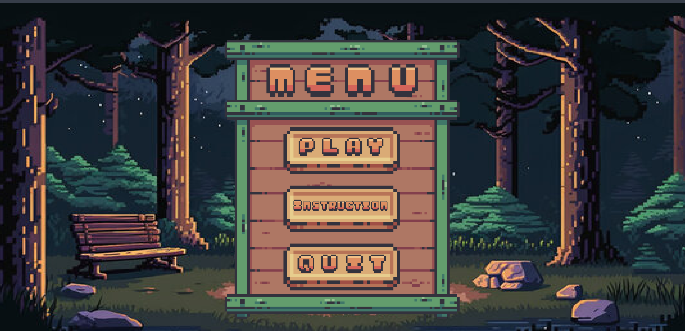
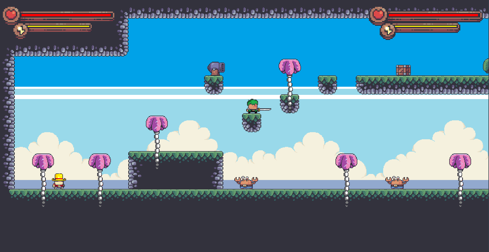

# Pirates Adventure

## Giới thiệu
Pirates Adventure là trò chơi platformer 2D chạy trên Java (Java 2D API) với phong cách pixel art. Trò chơi hỗ trợ 1 hoặc 2 người chơi, trong đó người chơi điều khiển hai nhân vật Luffy và Zoro (vẽ lại theo phong cách pixel art riêng). Game có tổng cộng 5 màn chơi với độ khó tăng dần, từ những màn cơ bản đến những màn thử thách với nhiều kẻ địch hơn. Các NPC (kẻ địch, các đối tượng tương tác) và cơ chế nhảy, di chuyển và tấn công. Mục tiêu là vượt qua các chướng ngại vật, đánh bại kẻ địch và hoàn thành cấp độ.

## Tính năng
- **Chơi đơn hoặc đôi:** Hỗ trợ chế độ chơi đơn và đôi cùng trên một màn hình.  
- **Nhân vật pixel art:** Luffy và Zoro được vẽ lại theo phong cách pixel art thủ công, mang hơi hướng anime (One Piece) nhưng vẫn phù hợp lối chơi retro.  
- **Năm màn chơi:** Game có 5 cấp độ với độ khó tăng dần, mỗi màn có thiết kế khác nhau (hòn đảo nhiệt đới, thành phố đổ nát, rừng rậm, v.v.).  
- **Cơ chế inherited:** Từ game gốc, giữ lại cơ chế nhảy, va chạm với địa hình, AI đơn giản của kẻ địch, đồng thời thêm thắt một số yếu tố tùy chỉnh cho phù hợp với chủ đề.  
- **Đồ họa và âm thanh:** Sử dụng ảnh nền và âm thanh phù hợp (ví dụ tiếng bước chân, nhạc nền cảnh hành động) với định dạng trong thư mục `res/`.  

## Điều khiển
- **Người chơi 1:** Sử dụng phím `A` (trái), `D` (phải) để di chuyển, phím `W` để nhảy.  
- **Người chơi 2:** Sử dụng phím `←` (trái), `→` (phải) để di chuyển, phím `↑` để nhảy.  
- **Điều khiển chung:** Phím `Esc` tạm dừng hoặc thoát game, phím `P` để tạm dừng.

## Cách cài đặt
1. **Cài đặt Java:** Đảm bảo đã cài JDK (Java Development Kit) phiên bản tương thích (ví dụ JDK 11 trở lên) và thiết lập biến môi trường `JAVA_HOME`.  
2. **Tải mã nguồn:** Clone hoặc tải về thư mục dự án từ kho chứa (ví dụ GitHub).  
3. **Biên dịch và chạy:** Sử dụng IDE (Eclipse/IntelliJ/ Visual Studio Code) hoặc dòng lệnh `javac` để biên dịch mã nguồn trong thư mục `src/`. Sau khi biên dịch, chạy chương trình chính (`Main.java`).
## Cấu trúc thư mục
- `src/` – Thư mục chứa mã nguồn Java (các lớp game, luồng game, xử lý va chạm, v.v.).  
- `res/` – Thư mục tài nguyên:
  - `res/` – Hình ảnh (pixel art nhân vật Luffy, Zoro, NPC, tileset nền, cây, v.v.).  
  - `res/levels/` – Dữ liệu các màn chơi.  
  - `res/audio/` – Âm thanh và nhạc nền.    
- `README.md` – Tệp hướng dẫn.  

## Hình ảnh minh họa

## Tài liệu tham khảo
- **PlatformerTutorial** - KaarinGaming
- Pixel Frog
- Java Object Oriented Programming Series - Caleb Curry
