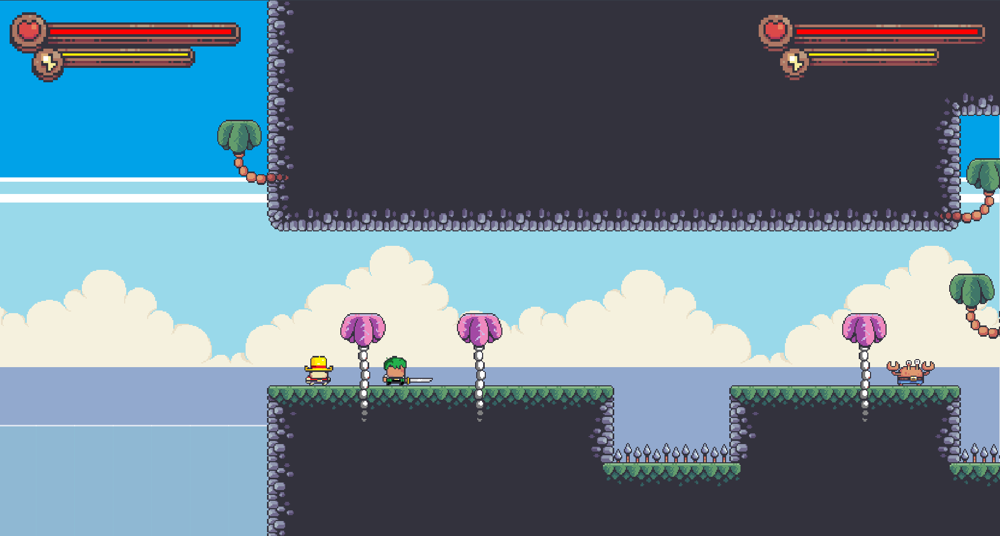

# 🏴‍☠️ Pirates Adventure  

## 🎮 Overview  
**Pirates Adventure** is a 2D platformer built in **Java (Java 2D API)** with a retro **pixel art** style.  
The game supports **1 or 2 players**, featuring two main characters: **Luffy** and **Zoro** (redesigned in unique pixel art).  
It includes **5 levels** with increasing difficulty, enemy NPCs, and interactive objects.  
Players can run, jump, attack, and overcome obstacles to defeat enemies and complete each stage.  

---

## ✨ Features  
- 👥 **Single or Co-op Mode**: Play solo or with a friend on the same screen.  
- 🎨 **Pixel Art Characters**: Hand-drawn pixel versions of **Luffy** and **Zoro**, inspired by *One Piece* but designed with a retro aesthetic.  
- 🏝️ **Five Unique Levels**: From tropical islands to ruined cities and dense jungles, each stage offers a new challenge.  
- ⚔️ **Classic Mechanics with Custom Additions**: Retains platforming basics (jumping, collisions, simple enemy AI) while adding pirate-themed elements.  
- 🔊 **Graphics & Sound**: Immersive backgrounds and audio (footsteps, combat sounds, action music) stored in the `res/` folder.  

---

## 🎮 Controls  
- **Player 1**:  
  - `A` = Move Left  
  - `D` = Move Right  
  - `W` = Jump  

- **Player 2**:  
  - `←` = Move Left  
  - `→` = Move Right  
  - `↑` = Jump  

- **General**:  
  - `Esc` = Pause/Exit  
  - `P` = Pause  

---
## 🕹️ How to Play  

- 🎯 **Objective**: Complete each stage by jumping across platforms, avoiding traps, and defeating enemies.  
- 🏃 **Movement**:  
  - **Player 1**: `A` (left), `D` (right), `W` (jump)  
  - **Player 2**: `←` (left), `→` (right), `↑` (jump)  
- ⚔️ **Combat**: Use the attack key (configured in-game) to fight enemies.  
- ❤️ **Lives**: Each player has limited health/lives – losing them all ends the game.  
- 🏆 **Winning**: Clear all **5 levels** to complete the adventure and claim victory.  
- ⏸️ **Pause/Exit**: Press `P` to pause and `Esc` to pause or exit the game.  

## ⚙️ Installation  
1. **Install Java**: Ensure you have **JDK 11+** installed and `JAVA_HOME` set up.  
2. **Get the Source Code**: Clone or download this repository.  
   ```bash
   git clone https://github.com/your-username/pirates-adventure.git

## 🖼️ Screenshots




## 📚 References

- 🎮 **Platformer Tutorial** – KaarinGaming  
- 🎨 **Pixel Frog** – Free pixel art game assets  
- 📘 **Java Object-Oriented Programming Series** – Caleb Curry  
